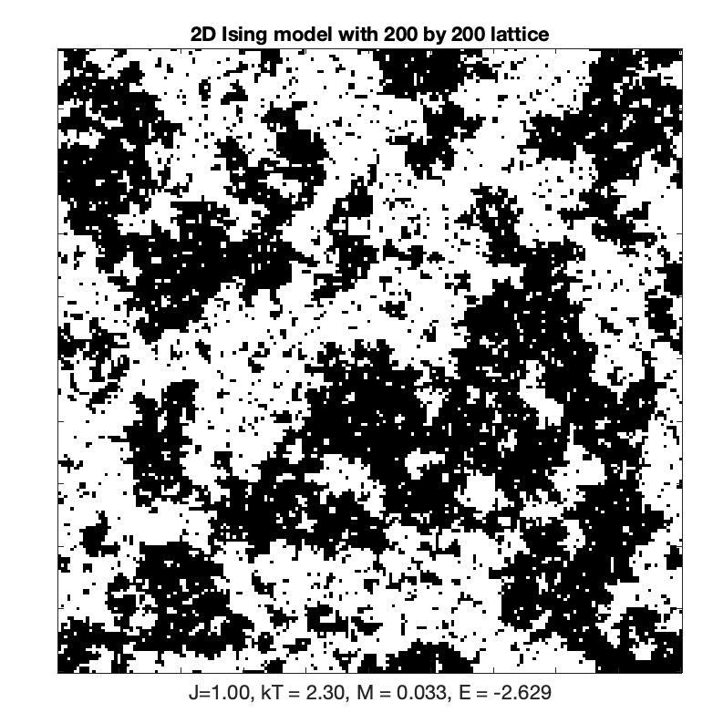

# IsingModel

## Python


## Matlab

See code in the `Matlab` directory for simulating the Ising Model in 2D.
Usage:

```matlab
IsingSim
```

- `IsingSim.m`: the main file which contains a simulator for the 2D Ising model using Metropolis and Wolff sampling, including parameters for temperature and coupling strength.

### Sampling:

- `MetropolisSample.m`: implements Metropolis (and Heat Bath) sampling on a configuration of Ising spins for some given amount of time.
- `WolffSample.m`: implements Wolff sampling on a configuration of Ising spins for some given amount of time.

### Computing:

- `IsingEnergy.m`: compute the energy density of a spin configuration.

### Plotting:

- `IsingPlot.m`: plot a configuration of spins.
- `CorrelationFun.m`: compute the 2D connected correlation function for a spin configuration.
- `RadialAvergage.m`: average out the angular dependence from a 2D connected correlation function.


