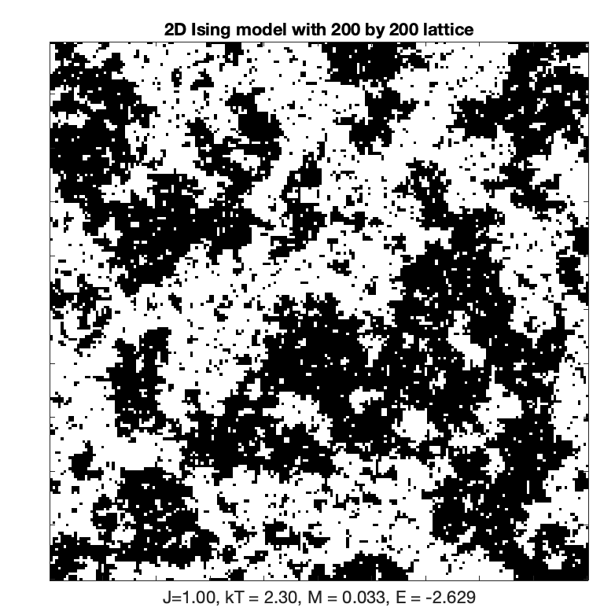

# 2D Ising Model

This repo contains code for simulating the 2D Ising model on a square lattice with Jupyter notebooks for class/lab use, standalone Python scripts, and the original MATLAB version.

The code demonstrates:

- Heat bath, Metropolis, and Wolff sampling
- Energy and magnetization traces
- Correlation functions and radial averages
- Cluster-size visualisation and statistics



## Setup

From the repo root:

macOS/Linux:

```bash
python -m venv .venv
source .venv/bin/activate
python -m pip install -r requirements.txt
```

Windows PowerShell:

```powershell
py -m venv .venv
.\.venv\Scripts\Activate.ps1
python -m pip install -r requirements.txt
```

Windows Command Prompt:

```bat
py -m venv .venv
.\.venv\Scripts\activate.bat
python -m pip install -r requirements.txt
```

If you are using VS Code or Jupyter, select the `.venv` kernel/interpreter after installing the requirements.

On Windows, the main differences are the virtual-environment activation command and sometimes using `py` instead of `python` to create the environment. The notebook and `python -m ...` commands are otherwise the same. If PowerShell blocks activation scripts, either use Command Prompt or allow scripts for the current shell session.

## Jupyter Notebooks

Use these for teaching and interactive exploration:

- `jupyter/IsingSim.ipynb`: main simulation notebook
- `jupyter/WolffDemo.ipynb`: interactive Wolff cluster update demo
- `jupyter/isingsim_funcs.py`: helper functions used by `IsingSim.ipynb`
- `jupyter/wolffdemo_funcs.py`: helper functions used by `WolffDemo.ipynb`

The main notebook keeps the important inputs near the top:

```python
N = 100
J = 1
kT = 2 / np.log(1 + np.sqrt(2)) * 0.85
samplingMethod = "HeatBath"
```

`N` is the side length of the lattice, so the total number of spins is `N**2`. Values around `50` to `200` are sensible for a lab notebook.

## Standalone Python

Run scripts from the repo root:

```bash
python python/IsingSim.py
python python/WolffDemo.py
python python/ClusterSizeStats.py
```

The raw Python modules are in `python/`:

- `IsingSim.py`: runs a full simulation and plots animation, correlations, energy, and magnetization
- `SampleGrid.py`: implements Heat Bath, Metropolis, and Wolff sampling
- `ClusterSizeStats.py`: plots spin clusters and the cluster-size distribution
- `CorrelationFun.py`, `RadialAverage.py`, `IsingEnergy.py`: analysis helpers
- `WolffDemo.py`, `WolffIteration.py`: Wolff cluster update demo and implementation

Some standalone plots use Matplotlib's Tk backend. If a GUI window does not open, run the notebook version or check that your Python install has Tk support.

## MATLAB

The MATLAB version is in `matlab/`.

Run:

```matlab
IsingSim
```

Useful files:

- `IsingSim.m`: main simulation script
- `SampleGrid.m`: Heat Bath, Metropolis, and Wolff sampling
- `WolffDemo.m`: Wolff cluster update demo
- `ClusterSizeStats.m`: cluster-size visualisation and statistics
- `CorrelationFun.m`, `RadialAverage.m`, `IsingEnergy.m`: analysis helpers

## Notes For Lab Use

- Start with `N = 100` for quick feedback.
- Increase `N` only gradually; memory scales as `N**2`.
- `HeatBath` and `Metropolis` use sweep-based updates when the sampling interval is one lattice sweep.
- `Wolff` updates whole clusters and can decorrelate faster near the critical temperature.
